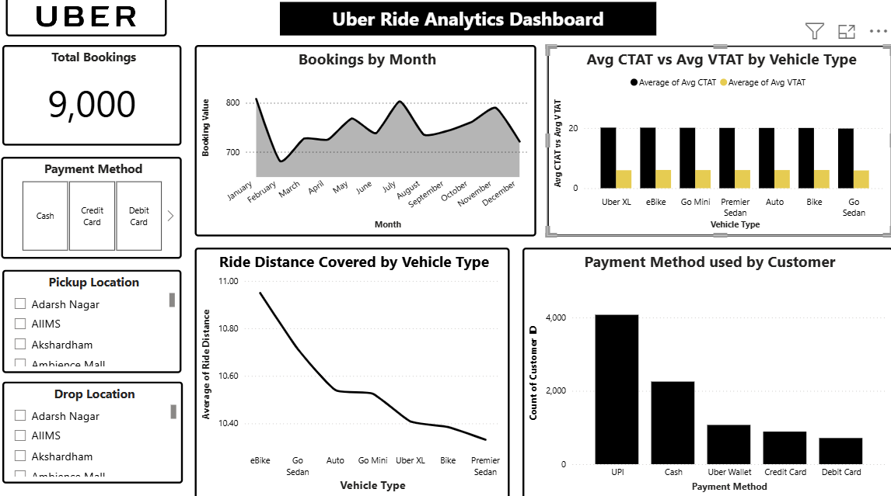

## Project 1: Uber Ride Analytics Dashboard

**Description:**  
An **interactive Power BI dashboard** providing insights into Uber ride patterns, vehicle usage, booking behaviours, and payment preferences. This dashboard helps business stakeholders understand operational performance, customer habits, and opportunities to optimize the ride-hailing service.

**Data Source & Cleaning:**  
- Dataset included booking dates, pickup/drop-off locations, vehicle types, VTAT & CTAT, ride distance, and payment methods.  
- Cleaning Steps:
  1. Handled missing values.  
  2. Standardised categorical variables (vehicle types, payment modes).  
  3. Ensured consistency in date/time columns.  
  4. Filtered outliers (extreme ride distances/times).

**Key Visualizations & Insights:**  
- **Total Bookings:** KPI card tracking 9,000 rides analysed.  
- **Seasonal Ride Trends:** Line/area chart showing monthly booking peaks in July & November.  
- **Ride Performance by Vehicle Type:** Clustered bar chart comparing VTAT vs CTAT.  
- **Ride Distance Analysis:** Line chart showing average ride distances by vehicle type.  
- **Payment Preferences:** Bar chart highlighting UPI as the most popular payment method.  
- **Pickup & Drop-off Hotspots:** Interactive filters identifying demand clusters.

**Design Considerations:**  
- Interactive filters for drill-down by payment method, pickup, and drop-off location.  
- Minimalist, clean layout focusing on insights.  
- Comparative analysis charts for quick evaluation of performance metrics.

**Impact:**  
- Uncovered operational inefficiencies, customer preferences, and demand patterns.  
- Potential extensions: real-time data, customer segmentation, cancellation analysis.

**Tools Used:**  
- Microsoft Power BI – dashboard design & visualisation  
- Excel / Power Query – data cleaning & preparation

**Power BI File / Download:**  
[Download Power BI File](https://github.com/orumaa/data-analytics-portfolio1/blob/main/Uber%20Ride%20Analytics%20Dashboard.pbix)  

**Screenshot:**  

**Author:** Oruma Shuaibu Ojochenemi  
🔗 [GitHub Portfolio](https://github.com/orumaa)

