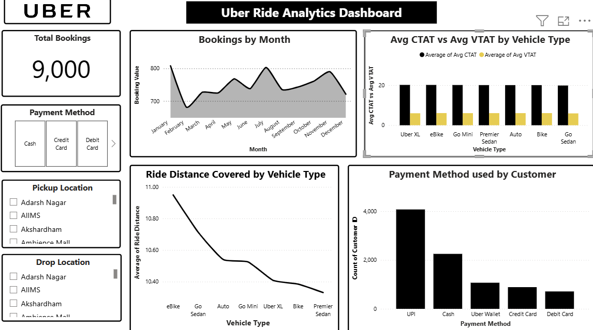

# 🚖 Uber Ride Analytics Dashboard – Project Story

## 📸 Dashboard Preview

## 🎯 Objective
This project aimed to design an **interactive dashboard** that provides insights into customer ride patterns, vehicle usage, booking behaviours, and payment preferences.  

By visualising these insights, the dashboard helps **business stakeholders** understand:
- Operational performance  
- Customer habits  
- Opportunities to optimise the ride-hailing service  

---

## 🗂️ Data & Cleaning Process
The dataset contained Uber ride booking details, including:  
- Booking dates  
- Pickup and drop-off locations  
- Vehicle types  
- Waiting time (VTAT) & Completion time (CTAT)  
- Ride distance  
- Payment methods  

**Steps taken:**
1. Handled missing values.  
2. Standardised categorical variables (vehicle types, payment modes).  
3. Ensured consistency in date/time columns for temporal analysis.  
4. Examined and filtered outliers (e.g., extreme ride distances, unusual ride times) to avoid skewed insights.  

---

## 📊 Key Insights Delivered

### ✅ Total Bookings
- **9,000 rides analysed** – highlighted via KPI card for quick performance tracking.  

### 📅 Seasonal Ride Trends
- A **line/area chart** tracks monthly booking volumes.  
- Clear peaks observed in **July** and **November**.  
- Helps identify seasonal demand fluctuations and supports **resource planning**.  

### 🚗 Ride Performance by Vehicle Type
- **Clustered bar chart** compares average **waiting time (VTAT)** vs **completion time (CTAT)** across vehicle types (Uber XL, Go Mini, Auto, etc.).  
- Smaller vehicles = shorter waiting times.  
- Larger vehicles = longer ride durations.  

### 📏 Ride Distance Analysis
- **Line chart** shows average ride distance by vehicle type.  
- **eBikes and Go Sedans** cover longer trips compared to Bikes or Premier Sedans.  

### 💳 Payment Preferences
- **Bar chart** shows UPI as the most preferred payment method, followed by **Cash**.  
- **Cards and Wallets** less popular.  
- Insight: Can guide **promotional strategies** or **payment provider partnerships**.  

### 📍 Pickup & Drop-off Hotspots
- Interactive filters allow analysis of **most popular pickup and drop locations**.  
- Crucial for identifying **demand clusters** and improving **driver allocation**.  

---

## 🎨 Design Considerations
- **Interactive Filters**: Drill down by payment method, pickup, and drop-off location.  
- **Minimalist Layout**: Clean, simple, insight-focused visuals.  
- **Comparative Analysis**: Charts designed for easy comparison (e.g., CTAT vs VTAT).  

---

## 🌍 Impact
This project demonstrates how **data visualisation** can uncover:  
- Operational inefficiencies  
- Customer preferences  
- Demand patterns in the ride-hailing industry  

The dashboard can be extended with:  
- Real-time data integration  
- Customer segmentation  
- Cancellation analysis  

to further **enhance decision-making for stakeholders**.  

---

## 🛠️ Tools Used
- **Microsoft Power BI** – dashboard design & visualization  
- **Excel / Power Query** – data cleaning & preparation  

---

👤 **Author:** Oruma Shuaibu Ojochenemi  
🔗 [GitHub Portfolio](https://github.com/orumaa)  

✨ *Thanks for visiting my portfolio! More projects coming soon.*

